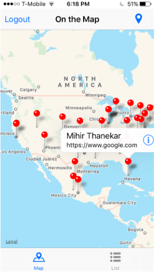

# On the Map

This app geocodes location information and shares it with others **around the world.**
You can even open a link others share in Safari and view information about them (e.g. location, name, link.. etc.) in a map or table as well.

## Features
- Login with Udacity
- Type a location name in and have a map animate to the place via MapKit and CLGeocoder
- `MKMapView` and `UITableView` with student names and links
- Networking with `URLSession` allows for GET, and POST requests.

## Some things I learned
- how to use MapKit
- GCD usage to enable responsive apps
- How to create extensions to improve code readability and style
- and more!

